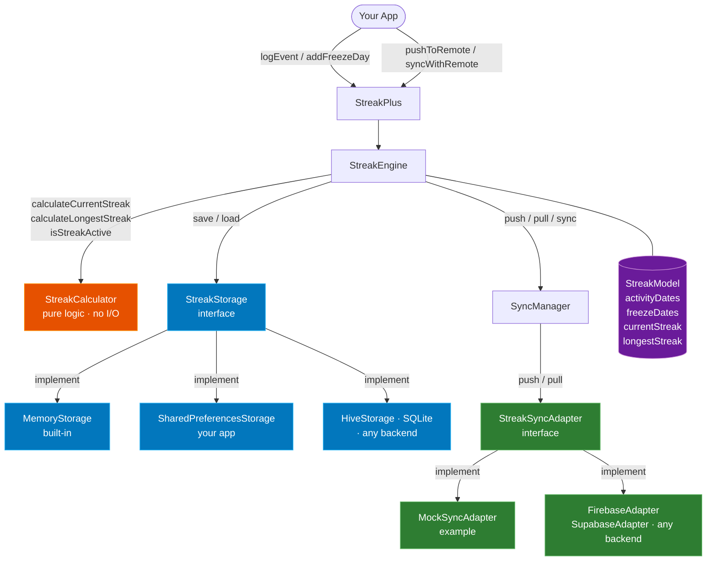
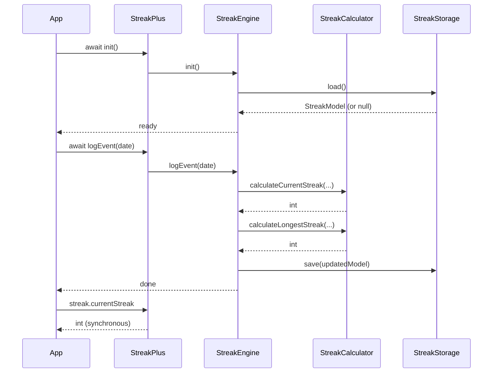
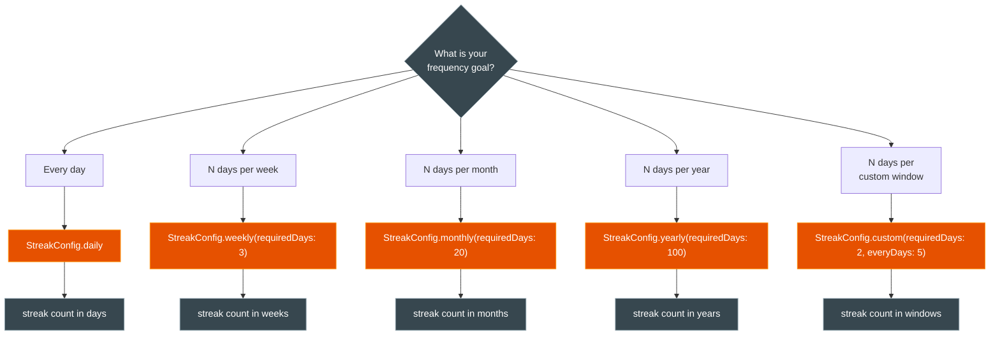
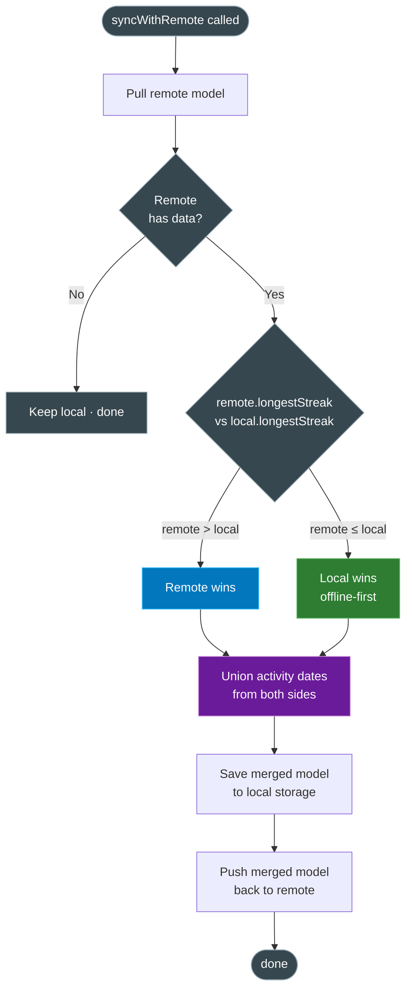

# streak_plus — monorepo

| Package | Description |
|---|---|
| [`streak_plus/`](streak_plus/) | Core library — streak engine, storage interface, sync interface |
| [`streak_plus_example/`](streak_plus_example/) | Flutter example app with three focused demo screens |

---

# streak_plus

A backend-agnostic, offline-first streak tracking engine for Flutter.

Track daily habits, weekly goals, monthly targets, or any custom frequency — with pluggable storage and optional remote sync.

---

## Features

- **Flexible streak types** — daily, weekly, monthly, yearly, or a custom N-day window
- **Freeze days** — protect a gap from breaking the streak (rest day, vacation, illness)
- **Pluggable storage** — bring your own backend: SharedPreferences, Hive, SQLite, secure storage, etc.
- **Optional remote sync** — bidirectional merge with conflict resolution (offline-first)
- **Pure calculation logic** — stateless, deterministic, easy to unit-test in isolation
- **Idempotent events** — logging the same date twice is always safe

---

## Architecture



---

## Event flow



---

## Streak type decision



---

## Sync conflict resolution



---

## Installation

```yaml
# pubspec.yaml
dependencies:
  streak_plus: ^0.0.1
```

---

## Quick start

```dart
import 'package:streak_plus/streak_plus.dart';

// 1. Create — MemoryStorage for tests, bring your own for production.
final streak = StreakPlus(storage: MemoryStorage());

// 2. Always await init() before reading or writing any state.
await streak.init();

// 3. Log activity.
await streak.logEvent(DateTime.now());

// 4. Read state — all getters are synchronous after init().
print(streak.currentStreak);    // 1
print(streak.longestStreak);    // 1
print(streak.isActive);         // true
print(streak.lastActivityDate); // today (UTC midnight)
```

---

## Streak types

Pass a `StreakConfig` to change how streaks are measured.
The streak count is expressed in the matching unit (days / weeks / months / etc.).

```dart
// Daily (default) — streak in days
StreakPlus(storage: storage, config: StreakConfig.daily);

// Weekly — streak in weeks; a week qualifies when it has ≥ 3 activity days (Mon–Sun)
StreakPlus(storage: storage, config: const StreakConfig.weekly(requiredDays: 3));

// Monthly — streak in months; a month qualifies when it has ≥ 20 activity days
StreakPlus(storage: storage, config: const StreakConfig.monthly(requiredDays: 20));

// Yearly — streak in years; a year qualifies when it has ≥ 100 activity days
StreakPlus(storage: storage, config: const StreakConfig.yearly(requiredDays: 100));

// Custom rolling window — streak in 5-day buckets; a bucket qualifies at ≥ 2 days
StreakPlus(
  storage: storage,
  config: const StreakConfig.custom(requiredDays: 2, everyDays: 5),
);
```

> `StreakConfig` is a runtime parameter — it is **not persisted**.
> Raw activity dates are always stored, so you can change the config without losing history.

---

## Freeze days

A freeze day bridges a **single** missing day so the streak does not break.

```
Mon  Tue  Wed  Thu  Fri
 ✓    ✓    –    ✓    ✓   ← without freeze: streak resets on the Wed gap
 ✓    ✓   ❄️    ✓    ✓   ← with freeze on Wed: streak continues unbroken
```

```dart
// Protect yesterday from breaking the streak
await streak.addFreezeDay(
  DateTime.now().subtract(const Duration(days: 1)),
);
```

> Freeze days cover a gap of exactly **one** missing day.
> Larger gaps always reset the streak.
> Freeze days apply to `StreakConfig.daily` only.

---

## Pluggable storage

Implement `StreakStorage` (three methods) to persist with any backend.

```dart
abstract class StreakStorage {
  Future<void>         save(StreakModel model);
  Future<StreakModel?> load();
  Future<void>         clear();
}
```

`StreakModel.toMap()` / `StreakModel.fromMap()` handle serialization — you only need to store and retrieve a `Map<String, dynamic>`.

### SharedPreferences example

```dart
class SharedPreferencesStorage implements StreakStorage {
  @override
  Future<void> save(StreakModel model) async {
    final prefs = await SharedPreferences.getInstance();
    await prefs.setString('streak', jsonEncode(model.toMap()));
  }

  @override
  Future<StreakModel?> load() async {
    final prefs = await SharedPreferences.getInstance();
    final json = prefs.getString('streak');
    if (json == null) return null;
    return StreakModel.fromMap(jsonDecode(json));
  }

  @override
  Future<void> clear() async =>
      (await SharedPreferences.getInstance()).remove('streak');
}
```

---

## Remote sync

Implement `StreakSyncAdapter` (two methods) to sync with any backend.

```dart
abstract class StreakSyncAdapter {
  Future<void>         push(StreakModel model); // upload local state
  Future<StreakModel?> pull();                  // fetch remote state
}
```

### Firebase Firestore example

```dart
class FirebaseStreakAdapter implements StreakSyncAdapter {
  final String userId;
  FirebaseStreakAdapter(this.userId);

  @override
  Future<void> push(StreakModel model) =>
      FirebaseFirestore.instance
          .collection('streaks')
          .doc(userId)
          .set(model.toMap());

  @override
  Future<StreakModel?> pull() async {
    final doc = await FirebaseFirestore.instance
        .collection('streaks')
        .doc(userId)
        .get();
    if (!doc.exists) return null;
    return StreakModel.fromMap(doc.data()!);
  }
}
```

### Wiring it in

```dart
final streak = StreakPlus(
  storage: SharedPreferencesStorage(),
  sync: FirebaseStreakAdapter(currentUser.uid),
);

// init() automatically pulls from remote on startup
await streak.init();

// Manual sync
await streak.pushToRemote();    // local → remote (one-way)
await streak.syncWithRemote();  // pull · merge · push (bidirectional)
```

### Conflict resolution

| Condition | Winner | Notes |
|---|---|---|
| `remote.longestStreak` > `local.longestStreak` | Remote | Remote has richer history |
| `remote.longestStreak` ≤ `local.longestStreak` | Local | Offline-first principle |
| Either side has unique activity dates | Both | Dates are always **unioned** — no events are lost |

---

## API reference

### `StreakPlus`

| Member | Kind | Description |
|---|---|---|
| `StreakPlus({storage, sync?, config?})` | constructor | Inject storage, optional sync adapter, optional config |
| `init()` | `Future<void>` | Load persisted state. **Must be awaited before anything else.** |
| `logEvent(date)` | `Future<void>` | Record activity on `date`. Idempotent. |
| `addFreezeDay(date)` | `Future<void>` | Mark `date` as a freeze day. |
| `currentStreak` | `int` | Running streak count (in the config's unit). |
| `longestStreak` | `int` | All-time best streak count. |
| `isActive` | `bool` | `true` when the streak is still alive and extendable today. |
| `lastActivityDate` | `DateTime?` | Most recent activity (UTC midnight), or `null`. |
| `snapshot` | `StreakModel` | Full immutable state snapshot. |
| `pushToRemote()` | `Future<void>` | Upload local state to remote. No-op without a sync adapter. |
| `syncWithRemote()` | `Future<void>` | Bidirectional sync: pull → merge → push. No-op without a sync adapter. |

### `StreakConfig`

| Constructor | Unit | Period qualifies when… |
|---|---|---|
| `StreakConfig.daily` | days | activity logged that day |
| `StreakConfig.weekly(requiredDays: n)` | weeks | ≥ n activity days in the Mon–Sun week |
| `StreakConfig.monthly(requiredDays: n)` | months | ≥ n activity days in the calendar month |
| `StreakConfig.yearly(requiredDays: n)` | years | ≥ n activity days in the calendar year |
| `StreakConfig.custom(requiredDays: n, everyDays: m)` | m-day windows | ≥ n activity days in the fixed m-day bucket |

### `StreakModel`

| Field | Type | Description |
|---|---|---|
| `activityDates` | `List<DateTime>` | All logged activity dates (UTC, sorted ascending) |
| `freezeDates` | `List<DateTime>` | All freeze dates (UTC, sorted ascending) |
| `currentStreak` | `int` | Cached current streak count |
| `longestStreak` | `int` | Cached all-time best |
| `lastActivityDate` | `DateTime?` | Most recent activity date |
| `toMap()` | `Map<String, dynamic>` | Serialize to a JSON-safe map |
| `StreakModel.fromMap(map)` | factory | Deserialize from a map |

---

## Design principles

| Principle | What it means |
|---|---|
| **Offline-first** | All reads/writes are local; sync is optional and always explicit |
| **No lock-in** | Storage and sync are interfaces — swap backends without touching library code |
| **Idempotent** | `logEvent` and `addFreezeDay` are safe to repeat with the same date |
| **Deterministic** | `StreakCalculator` is pure (no I/O); same inputs always produce the same output |
| **UTC dates** | All dates normalised to UTC midnight to avoid timezone drift |
| **Config is runtime** | `StreakConfig` is not persisted — change frequency goals without losing history |

---

## Running the example app

```bash
cd streak_plus_example
flutter pub get
flutter run
```

| Screen | What it demonstrates |
|---|---|
| **01 · Daily streak** | `init`, `logEvent`, `addFreezeDay`, reading all state properties |
| **02 · Streak types** | All `StreakConfig` variants displayed side by side on the same activity data |
| **03 · Sync adapter** | `pushToRemote`, `syncWithRemote`, and an adapter implementation skeleton |
